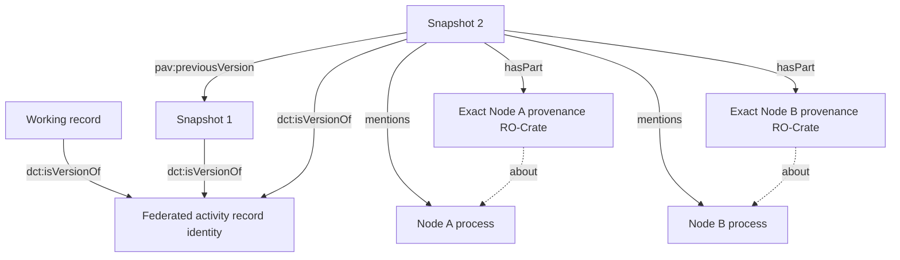

# Five Safes RO-Crate 1.0

Authors:

1. Alexander Hambley, The University of Manchester <https://orcid.org/0000-0003-1193-6632>
2. Warren Del-Pinto, The University of Manchester <https://orcid.org/0000-0003-3307-9432>
3. Douglas Lowe, The University of Manchester <https://orcid.org/0000-0002-1248-3594>
4. Ettore Murabito, The University of Manchester <https://orcid.org/0000-0002-9308-9889>
5. Eli Chadwick, The University of Manchester <https://orcid.org/0000-0002-0035-6475>
6. Stian Soiland-Reyes, The University of Manchester <https://orcid.org/0000-0001-9842-9718>

This document specifies a profile of [RO-Crate](https://w3id.org/ro/crate) for recording and exchanging the activity of Trusted Research Environments (TREs).

* Permalink: <https://w3id.org/5s-crate/1.0>
* Version: 1.0
* Status: Working Draft
* Release notes: <https://github.com/eScienceLab/Five-Safes-RO-Crate/releases>
* Published: 2027-XX-XX
* Comments and suggestions: <https://github.com/eScienceLab/Five-Safes-RO-Crate/issues>

_The key words "MUST", "MUST NOT", "REQUIRED", "SHALL", "SHALL NOT", "SHOULD", "SHOULD NOT", "RECOMMENDED", "NOT RECOMMENDED", "MAY", and "OPTIONAL" in this document are to be interpreted as described in BCP 14 [[RFC2119](https://doi.org/10.17487/RFC2119)] [[RFC8174](https://doi.org/10.17487/RFC8174)] when, and only when, they appear in all capitals, as shown here._

!!! tip
    All references to schema.org types/properties/instances use the prefix `http://schema.org/` (not https) to correspond with their official JSON-LD context.

## Introduction

The [Five Safes](https://doi.org/10.13140/RG.2.1.3661.1604) framework ([Desai, Ritchie and Welpton, 2016](#references)) is an approach to consider safe access to sensitive data across five dimensions: safe projects, safe people, safe settings, safe data, and safe outputs. In TREs, this is applied through governance: work is proposed and approved, researchers are accredited, environments are controlled, data is prepared, and outputs are checked.

A Five Safes RO-Crate records this activity so that it can be retained as provenance, exchanged between systems, and inspected later. This profile specifies how that activity is represented as an RO-Crate.

This profile succeeds [Five Safes RO-Crate 0.4](https://w3id.org/5s-crate/0.4).

## Design Principles

The Five Safes Profile is designed with a focus on TREs. As such, it focuses on three core types of *Thing* that exist within TREs: Assets, Processes and Contexts.

### Assets, Processes, Contexts

Every entity described within a Five Safes RO-Crate falls into one of three types.

| Type        | Description                                                                                                           |
| ----------- | --------------------------------------------------------------------------------------------------------------------- |
| **Asset**   | “*Things that are acted on*”<br>**Examples:** datasets, outputs, models, software, plans, protocols, agreement texts. |
| **Process** | “*Things that happen*”<br>**Examples:** submitting requests, running queries, granting access, checking outputs, ...  |
| **Context** | “*Things that act / are acted under*”<br>**Examples:** people, organisations, agreements, TREs...                     |

Note that this means there may be several entities corresponding to instances of the same "idea", or related "ideas". For example: 

- A protocol or plan is an *asset*, whilst an instance of applying or following it is a *process*. 
- A source dataset is an *asset*, while a dataset derived from it is a separate *asset* with its own history.

Some other examples of these entity types occurring in practice are:

- A request for access still exists as a *process* that occurred, even if it was declined and work did not proceed.
- Contexts can be the subjects of processes. For example, accrediting a researcher is a *process*.
- Each context item is recorded once and referred to wherever needed.

Notably, there is no "*Project*" entity type. This is to avoid making the core Five Safes Profile too prescriptive, since projects can have very different scopes or meanings depending on the organisation(s) involved, or even the timeframe in which work was undertaken. Instead, the root of the profile is based around an *Activity Record*.

### The TRE Activity Record

A **TRE Activity Record** ("activity record") is a versioned account of activity in a TRE. Each activity record covers one piece of **governed work** under the applicable TRE or federation arrangements, from a single cohort discovery query to a study lasting years. If work consists of several organisations, one activity record captures the whole piece of work.

An activity record grows as the work progresses, and may capture queries and analyses, decisions about them, the agreements which govern them, and any outputs that are released. This activity record is represented as a **Five Safes RO-Crate**.

### Observation and Scope

An activity record focuses on activity that was observed or attested: this is work in which a system captured the event as it happened, such as a portal logging each query, or work that a person or organisation stated happened, such as a manual output review. 

A portal may record every query, or an interactive workspace may capture only the governance points around a session, with the analysis between them summarised. Both are valid activity records with different scopes. 


### Working Record and Snapshots

The **working record** reflects the current activity record, and captures the understanding of the work and changes as queries run, decisions are returned, and outputs appear. A **snapshot** is a fixed copy of the working record taken at a significant moment, and once published, it is never changed. 

The working record keeps one identity throughout its life, meaning "this piece of work"; each snapshot has its own identity, meaning "this piece of work, exactly as it stood at this point". A snapshot carries a version number and, after the first, a link to its predecessor; the working record carries neither. Together, the working record and snapshots form a record sequence; each is a **representation** of the activity record. 

This profile does not prescribe when you should take a snapshot. However, submitting, exchanging, and closing an activity record are reasonable choices.

### Core and Modules

Every Five Safes RO-Crate must follow the **core** profile outlined in this document. Additional **modules** add specifications for particular kinds of work, such as output checking, cohort discovery, or workflow execution. An activity record may follow the core alone or declare any combination of modules.

## Structure of a Five Safes RO-Crate

A Five Safes RO-Crate is an RO-Crate that contains a metadata file that describes its contents. The following sections outline the metadata file and structure.

### Metadata File

The `ro-crate-metadata.json` metadata file MUST conform to [RO-Crate 1.3](https://www.researchobject.org/ro-crate/specification/1.3/), and its descriptor MUST declare the version it conforms to. 

```json
{
  "@type": "CreativeWork",
  "@id": "ro-crate-metadata.json",
  "about": {"@id": "./"},
  "conformsTo": {"@id": "https://w3id.org/ro/crate/1.3"}
}
```

### JSON-LD

The core profile defines no vocabulary of its own, so an RO-Crate conforming to this core needs no context beyond RO-Crate. The context SHOULD be given in the array form, so that a module may add to it:

```json
{ "@context": ["https://w3id.org/ro/crate/1.3/context"],
  "@graph": [ ]
}
```

A term used as a property value MUST be written as a full absolute IRI in `{"@id": "..."}` form, whilst a term used in `@type` is written as a plain string:

```json
{
  "@id": "urn:uuid:3c9a5b1e-8f42-4d6a-9e07-b52d81c4a7f6",
  "@type": ["CreateAction", "prov:Activity"],
  "actionStatus": {"@id": "http://schema.org/CompletedActionStatus"}
}
```

Writing `"actionStatus": "CompletedActionStatus"` instead produces the text `"CompletedActionStatus"`, not a reference to the term. This is because the RO-Crate context does not coerce property values to references.

!!! warning
    The RO-Crate context binds `pav`, `prov` and `dct` among others, so `pav:previousVersion` and `dct:isVersionOf` can be written in short form. Note that it binds `dct`, not `dcterms`.

A module may require an additional context and further vocabularies; the rules for declaring and describing them are in [Authoring Modules](authoring-modules.md).

### Entity Identifiers

Every entity described as a separate node in `@graph` MUST have an absolute IRI as its `@id`, with three exceptions: the metadata descriptor (`ro-crate-metadata.json`); the Root Data Entity, and contained `File` or `Dataset` entities (their relative payload paths). A UUID URN is sufficient and does not need to resolve.

### Complete Example

The following is a complete, minimal conforming working record of a feasibility query executed in a TRE, with the query and its output held in the RO-Crate. It uses an absolute `@id` on the Root Data Entity, with the metadata descriptor's `about` set to the same value:

```json
{
  "@context": ["https://w3id.org/ro/crate/1.3/context"],
  "@graph": [
    {
      "@type": "CreativeWork",
      "@id": "ro-crate-metadata.json",
      "about": {"@id": "https://tre72.example.org/activities/A123/current"},
      "conformsTo": {"@id": "https://w3id.org/ro/crate/1.3"}
    },
    {
      "@id": "https://tre72.example.org/activities/A123/current",
      "@type": "Dataset",
      "conformsTo": [{"@id": "https://w3id.org/5s-crate/1.0"}],
      "identifier": {"@id": "https://tre72.example.org/activities/A123/current"},
      "dct:isVersionOf": {"@id": "https://tre72.example.org/activities/A123"},
      "name": "Feasibility enquiry A123 (TRE72)",
      "description": "Cohort feasibility counts for the A123 enquiry.",
      "dateCreated": "2027-03-13T09:00:00Z",
      "dateModified": "2027-03-14T09:20:31Z",
      "datePublished": "2027-03-13T09:01:00Z",
      "license": {"@id": "https://creativecommons.org/publicdomain/zero/1.0/"},
      "publisher": {"@id": "https://ror.org/027m9bs27"},
      "hasPart": [{"@id": "query.sql"}, {"@id": "outputs/counts.csv"}],
      "mentions": [{"@id": "urn:uuid:6b1eaa63-25b0-4dd2-9c92-a35a3f5cd58a"}]
    },
    {
      "@id": "https://w3id.org/5s-crate/1.0",
      "@type": ["CreativeWork", "Profile"],
      "name": "Five Safes RO-Crate profile",
      "version": "1.0"
    },
    {
      "@id": "urn:uuid:6b1eaa63-25b0-4dd2-9c92-a35a3f5cd58a",
      "@type": ["CreateAction", "prov:Activity"],
      "name": "Execute feasibility query",
      "agent": {"@id": "https://orcid.org/0000-0002-1825-0097"},
      "provider": {"@id": "https://ror.org/027m9bs27"},
      "object": {"@id": "query.sql"},
      "result": {"@id": "outputs/counts.csv"},
      "startTime": "2027-03-14T09:20:30Z",
      "endTime": "2027-03-14T09:20:31Z",
      "actionStatus": {"@id": "http://schema.org/CompletedActionStatus"}
    },
    {
      "@id": "query.sql",
      "@type": "File",
      "name": "Feasibility query",
      "encodingFormat": "application/sql"
    },
    {
      "@id": "outputs/counts.csv",
      "@type": "File",
      "name": "Feasibility counts",
      "encodingFormat": "text/csv"
    },
    {
      "@id": "https://orcid.org/0000-0002-1825-0097",
      "@type": "Person",
      "name": "Example analyst",
      "affiliation": {"@id": "https://ror.org/027m9bs27"}
    },
    {
      "@id": "https://ror.org/027m9bs27",
      "@type": "Organization",
      "name": "TRE72"
    }
  ]
}
```

To publish a snapshot, a producer copies the working record and changes the Root Data Entity. `identifier` becomes the snapshot's own IRI, such as `.../activities/A123/versions/1` for the first; `version` is added with the matching integer, and `dateCreated` is set to when the snapshot was taken. Any `dateModified` is removed, and `datePublished` is set to when the snapshot was made available. 

If the Root Data Entity has an absolute `@id`, it MUST be changed to an absolute IRI identifying the snapshot, and the metadata descriptor's `about` changes with it (see: [Versioning and Snapshots](#versioning-and-snapshots)).

## Root Data Entity

The Root Data Entity describes this RO-Crate as a single representation of the activity record. This profile uses two identifiers: 

- `identifier` is the canonical RO-Crate identifier, and specifies this particular RO-Crate representation; 
- `dct:isVersionOf` identifies the activity record across all its versions.

[Versioning and Snapshots](#versioning-and-snapshots) define both fully.

Alongside the properties RO-Crate requires of any Root Data Entity, this profile requires the following:

| Property | Requirement | Description |
|---|---|---|
| `@id` | MUST | Identifies the Root Data Entity. The metadata descriptor's `about` MUST use exactly the same value. |
| `@type` | MUST | `Dataset`, or an array containing `Dataset`. |
| `conformsTo` | MUST | This profile's IRI and the IRI of each declared module; other application profiles MAY be present. Each profile IRI MUST also be described by a contextual entity. See: [Conformance and Modules](#conformance-and-modules). |
| `identifier` | MUST, exactly one | The canonical RO-Crate identifier. See: [Record and RO-Crate Identifiers](#record-and-ro-crate-identifiers). |
| `dct:isVersionOf` | MUST, exactly one | The activity record identifier. See: [Record and RO-Crate Identifiers](#record-and-ro-crate-identifiers). |
| `name` | MUST | Names the activity record. |
| `description` | MUST | Describes the work the activity record covers. |
| `dateCreated` | MUST, exactly one | When this representation was created. |
| `dateModified` | MUST, exactly one if a working record has changed since creation; <br> <br> MUST NOT on a snapshot | The most recent actual change. |
| `datePublished` | MUST, exactly one | When this representation was first published. See: [Representation Dates](#representation-dates). |
| `license` | SHOULD, on a published RO-Crate | Describes the licence of the output data, either an open licence or restrictive, TRE-specific conditions of access. |
| `publisher` | SHOULD | The `Organization` that published this representation. |
| `version` | MUST, exactly one on a snapshot; <br> <br> MUST NOT, on a working record | A positive JSON integer. See: [Representation State](#representation-state). |
| `pav:previousVersion` | MUST, exactly one on a snapshot after the first; <br> <br> MUST NOT, otherwise | The canonical RO-Crate identifier of the direct predecessor. |
| `hasPart` | MUST, if the RO-Crate holds or refers to data entities | Each data entity MUST be reachable from the Root Data Entity through `hasPart`, directly or through nested `Dataset` entities. |
| `mentions` | MUST, if the RO-Crate records any processes | The processes recorded in this RO-Crate. See: [Processes](#processes). |

!!! tip
    The Root Data Entity's `@id` does not by itself determine whether an RO-Crate is Attached or Detached. Those forms depend on how the metadata document and any payload are packaged, [as defined in the RO-Crate 1.3 base profile](https://www.researchobject.org/ro-crate/specification/1.3/root-data-entity.html#root-data-entity-identifier).

## Assets

Assets are the durable things processes act on, consume, produce, or follow.

### Kinds of Asset

An asset representing a file or dataset MUST be a [data entity](https://www.researchobject.org/ro-crate/specification/1.3/data-entities.html) that is reachable from the Root Data Entity through `hasPart`. An abstract asset, such as a plan, an exact protocol version, or a software application, is instead a [contextual entity](https://www.researchobject.org/ro-crate/specification/1.3/contextual-entities.html) with an absolute IRI, referenced from the processes for which it is relevant. The table below outlines a non-exhaustive list of assets, and how they should be described:

| Asset | Described as |
|---|---|
| A file held in the RO-Crate | `File`, with its relative payload path as `@id` |
| A directory held in the RO-Crate | `Dataset`, with its relative payload path as `@id` |
| Data represented without its payload | `File` or `Dataset` with an absolute IRI |
| A packaged software source file | `["File", "SoftwareSourceCode"]` |
| An exact software version referred to by a process | `SoftwareApplication` or `SoftwareSourceCode`, with an absolute IRI |
| An exact procedure or protocol version | `CreativeWork`, and MAY add `HowTo`, with an absolute IRI |
| A plan for intended work | `["CreativeWork", "prov:Plan"]`, with an absolute IRI |
| An exact trained-model version | `File`, `Dataset`, or another appropriate type |

An asset SHOULD carry `name`. A versioned asset such as a protocol, software, or a released extract SHOULD carry `version` as text, using the label the asset already has. 

Software that a process has used is a contextual entity, and SHOULD be recorded as the `instrument` of the process that used it:

```json
[
  {
    "@id": "urn:uuid:e47d2a90-6b13-4c58-8f2e-a90d5c3b7e14",
    "@type": ["CreateAction", "prov:Activity"],
    "name": "Deidentification",
    "instrument": {"@id": "https://example.org/software/deid-tool/2.1"}
  },
  {
    "@id": "https://example.org/software/deid-tool/2.1",
    "@type": "SoftwareApplication",
    "name": "Deidentification Tool",
    "version": "2.1"
  }
]
```

A data entity represented by reference has an absolute IRI as its `@id`, is listed under `hasPart`, and MUST NOT also use a relative path as though it were a contained file. A referenced RO-Crate follows [Referencing Another RO-Crate](#referencing-another-ro-crate). 

Whilst governance determines whether a payload is included, an asset only referred to is still a first-class asset that processes name in the ordinary way.

### Referencing Assets from Processes

A process refers to the assets it acted on with `object`, `result`, and `instrument`, and to the artefacts it referred to as provenance with `prov:used`. A file or directory held in this RO-Crate MAY be referenced directly by its relative path. 

!!! note
    A relative path always means the copy inside the containing RO-Crate. The same path in a snapshot identifies that snapshot's own copy.

Therefore, an asset MUST be referenced through an entity with an absolute IRI where the exact asset needs an identity beyond this one RO-Crate. This may be when it is the `object` of a `SendAction` or `ReceiveAction`; it is identified by a decision, as its `object` or under `prov:used`; or when the producer asserts it is the same asset as one described in another RO-Crate, or across representations of the activity record.

Reuse of an absolute `@id` across descriptions and representations follows [Identity Across Representations](#identity-across-representations): one IRI names one exact asset and version throughout a record sequence.

### Packaged Copies of Identified Assets

An asset with an absolute IRI and a copy of that asset included in the RO-Crate MUST be described as two separate entities:

```plaintext
outputs/count-v1.csv
    └── encodesCreativeWork
          └── https://tre72.example.org/activities/A123/assets/count/v1
```

!!! tip "Why are there separate entities?"
    The absolute IRI identifies the asset independently of the RO-Crate. The relative path identifies the copy carried inside this particular RO-Crate. For example, `https://example.org/reports/17` identifies a report, whilst `files/report.pdf` identifies the PDF copy included in the RO-Crate. Keeping these separate allows the same asset to be packaged at different paths or in different formats without incorrectly treating each copy as a new asset version.

A packaged file MUST use `encodesCreativeWork` for this relationship. A packaged directory MUST instead use `exampleOfWork`. In either case, the target MUST identify the exact asset version and MUST be typed as `CreativeWork` or one of its subtypes, such as `Dataset`. 
<!-- The core profile does not define an equivalent relationship for an asset that is not a CreativeWork. -->

Moving, renaming, or encoding the same asset in another format does not by itself create a new version or asset. Therefore, multiple packaged representations can point to the same absolute IRI. `prov:wasDerivedFrom` MUST NOT be used to connect a packaged representation to the asset it encodes; it is reserved for cases in which a process produced a distinct asset from another asset.

The following fragment shows a cohort discovery output given an absolute identity for a release decision, and a data use agreement. These are also given packaged copies:

```json
[
  {
    "@id": "https://tre72.example.org/activities/A123/assets/count/v1",
    "@type": "Dataset",
    "name": "Cohort count result, version 1",
    "version": "1"
  },
  {
    "@id": "outputs/count-v1.csv",
    "@type": ["File", "DataDownload"],
    "name": "CSV encoding of cohort count result, version 1",
    "encodingFormat": "text/csv",
    "encodesCreativeWork": {
      "@id": "https://tre72.example.org/activities/A123/assets/count/v1"
    }
  },
  {
    "@id": "https://tre72.example.org/agreements/DUA-42/versions/3",
    "@type": "CreativeWork",
    "name": "Data use agreement 42, version 3",
    "version": "3"
  },
  {
    "@id": "agreements/dua-v3.pdf",
    "@type": "File",
    "name": "PDF encoding of data use agreement 42, version 3",
    "encodingFormat": "application/pdf",
    "encodesCreativeWork": {
      "@id": "https://tre72.example.org/agreements/DUA-42/versions/3"
    }
  }
]
```

### Protocols

A protocol is an asset that establishes how something is intended to be done. Each occasion of following it is a separate process instance that records the exact protocol version, with `instrument` referring to the absolute protocol entity. The same asset may be a protocol for one process and an ordinary input to another.

### Derived Data

Data produced by a process MUST be a separate asset from the data it came from, and MUST NOT be captured as a revision of its source. 

The producing process documents source and product as its `object` and `result`, and where derivation was observed or attested, the derived asset SHOULD also identify its source with `prov:wasDerivedFrom`, so the relationship survives being read without the process. An RO-Crate MUST use `prov:wasDerivedFrom` only on that basis.

### Software and Models

A held or produced software or trained-model asset SHOULD carry `name` and `version`, and `author` where known. A model produced by a recorded process is its `result`; a model assessed or decided upon is that process's `object`. 
<!-- This profile does not determine whether a model may be transferred or released - module? -->

## Processes

Processes are the things that happen. For example, a researcher executing an SQL query on some data; software applying a deidentification protocol on free-text data; or an output checker verifying outputs during the disclosure control process. Each MUST be a [Contextual Entity](https://www.researchobject.org/ro-crate/specification/1.3/contextual-entities.html), referenced from the Root Data Entity's `mentions`.

### Process Shape

Every process MUST be an [Action](http://schema.org/Action) whose `@type` includes one of the types in [Kinds of Process](#kinds-of-process) and also `prov:Activity`.

| Property | Requirement | Description |
|---|---|---|
| `@id` | MUST | An absolute IRI identifying this process occurrence. |
| `@type` | MUST | See [Kinds of Process](#kinds-of-process). |
| `agent` | MUST | The people or organisations that directly performed or operated the process, each described in the RO-Crate as a `Person` or `Organization`. |
| `actionStatus` | MUST, exactly one | See [Status](#status); written as `{"@id": ...}`. |
| `name` | SHOULD | What happened, in words. |
| `object` | SHOULD | What the process acted on. A decision MUST have at least one value identifying what was decided upon. |
| `result` | MUST; <br><br> MUST NOT | A `CreateAction` with `CompletedActionStatus` that produced an asset MUST identify it. <br><br> An anticipated, suppressed, or withheld output MUST NOT appear as `result`. |
| `instrument` | SHOULD, where assets actually helped perform the process | The exact protocol, software, or other asset that helped; applicability alone does not make an asset an instrument. |
| `provider` | MUST, where the process was carried out within a TRE [or one of its nodes](#the-tre-and-its-nodes) | The `Organization` that provided or operated the environment or service. |
| `prov:atLocation` | MAY | A runtime location (workspace, virtual machine), with an absolute `@id` and `@type` including `Thing` and `prov:Location`. |
| `startTime` | SHOULD | When the process actually began; never an anticipated time. |
| `endTime` | MUST, where `actionStatus` is `CompletedActionStatus` or `FailedActionStatus`; <br><br> MUST NOT where `ActiveActionStatus` | When the process ended. |
| `description` | MAY | Further detail, such as the command run. |

Asset references from `object`, `result`, `instrument`, and `prov:used` follow [Referencing Assets from Processes](#referencing-assets-from-processes).

### Kinds of Process

| Kind | Described as |
|---|---|
| Submitting a plan for action | `AskAction` |
| Work intended to create an asset, such as a query execution or workflow run | `CreateAction` |
| Work that produces no asset and has no more specific type below | `Action` |
| A check or assessment that reaches no decision by itself | `AssessAction` |
| A decision that permits something | `AuthorizeAction` |
| A decision that refuses something | `RejectAction` |
| Withdrawing a request before the work begins | `CancelAction` |
| A change to the record or the RO-Crate as a whole | `UpdateAction` |
| Moving something between parties | `SendAction`, `ReceiveAction` |


The `@type` array MAY include further, more specific types alongside a listed type.

An `AssessAction` records a check or assessment but does not itself assert permission or refusal, and any such decision MUST be recorded as a separate `AuthorizeAction` or `RejectAction`; the outcome is distinguished by that type.

A process MAY carry `additionalType`, referring to the exact IRI of a published term for a more specific kind of process. If the term comes from another vocabulary, its exact published IRI MUST be used and its published meaning MUST NOT be changed. A module MAY define or require terms for the processes it covers.

Work that intended to create an artefact but completed without returning one MUST keep its `CreateAction` type and `CompletedActionStatus`, MUST NOT record a `result`, and SHOULD explain the outcome in `description`.

!!! tip
    `CreateAction` should be used for changes to a file within a dataset, with the original as `object` and the new version as `result`. `UpdateAction` should be used for changes affecting the activity record as a whole.

### Requests, Plans, and Execution

Intended work recorded before it begins MUST be an asset whose `@type` includes `prov:Plan` and has an absolute IRI. A plan submitted for action MUST identify the exact submitted version: a change after submission creates a new plan with a new `@id`, linked to its immediate predecessor with `pav:previousVersion`. 

Submitting a plan MUST be a separate `AskAction` with exactly one object (the plan), exactly one recipient (the person or organisation asked to act, described in the RO-Crate as a `Person` or `Organization`) and `CompletedActionStatus`. 

A decision made on the request MUST be a separate `AuthorizeAction` or `RejectAction` with the same plan version as its only object, identifying the `AskAction` with `prov:wasInformedBy`. 

`CancelAction` describes future work that will no longer happen, such as withdrawing a pending request. This follows the pattern above. 

If the planned work begins, each execution attempt MUST be a separate `Action` with its own identity, status, and times; one plan may have any number of executions. A conforming RO-Crate SHOULD record every observed or attested execution attempt within its [scope](#observation-and-scope). A failed attempt MUST NOT be changed back to active; a retry MUST be a new `Action`.

When planned work is executed, the execution MUST link to the plan through at least one `prov:qualifiedAssociation`. This is a Contextual Entity typed `prov:Association` with exactly one `prov:agent`, which is also an `agent` of the execution, and exactly one `prov:hadPlan` identifying the exact plan version. There should be one association per agent-and-plan pair.


In the diagram above, the request, decision, withdrawal, and execution are independent claims. Note that the arrows are properties recorded in the metadata and do not imply that all the processes shown occurred.

The following fragment describes a submitted plan, its request, and one execution linked to the plan through an association. The decision answering this request is shown under [Decision Subjects and Provenance](#decision-subjects-and-provenance); the person and organisation entities are omitted:

```json
[
  {
    "@id": "https://tre72.example.org/activities/A123/plans/enquiry-3f2b",
    "@type": ["CreativeWork", "prov:Plan"],
    "name": "Analysis plan for enquiry A123"
  },
  {
    "@id": "https://tre72.example.org/activities/A123/requests/enquiry-3f2b",
    "@type": ["AskAction", "prov:Activity"],
    "name": "Submit analysis plan",
    "agent": {"@id": "https://orcid.org/0000-0002-1825-0097"},
    "provider": {"@id": "https://ror.org/027m9bs27"},
    "object": {
      "@id": "https://tre72.example.org/activities/A123/plans/enquiry-3f2b"
    },
    "recipient": {"@id": "https://ror.org/027m9bs27"},
    "endTime": "2027-03-13T15:00:00Z",
    "actionStatus": {"@id": "http://schema.org/CompletedActionStatus"}
  },
  {
    "@id": "https://tre72.example.org/activities/A123/runs/run-1",
    "@type": ["CreateAction", "prov:Activity"],
    "name": "Execute approved analysis",
    "agent": {"@id": "https://orcid.org/0000-0002-1825-0097"},
    "provider": {"@id": "https://ror.org/027m9bs27"},
    "prov:qualifiedAssociation": {
      "@id": "urn:uuid:d0f1c2b3-4a5e-4f60-9b7c-8d9e0f1a2b3c"
    },
    "result": {"@id": "outputs/analysis-report.html"},
    "startTime": "2027-03-14T10:00:00Z",
    "endTime": "2027-03-14T11:30:00Z",
    "actionStatus": {"@id": "http://schema.org/CompletedActionStatus"}
  },
  {
    "@id": "urn:uuid:d0f1c2b3-4a5e-4f60-9b7c-8d9e0f1a2b3c",
    "@type": "prov:Association",
    "prov:agent": {"@id": "https://orcid.org/0000-0002-1825-0097"},
    "prov:hadPlan": {
      "@id": "https://tre72.example.org/activities/A123/plans/enquiry-3f2b"
    }
  }
]
```

### Status

| Value | Meaning |
|---|---|
| `ActiveActionStatus` | The process has begun and is still running. |
| `CompletedActionStatus` | The process finished. |
| `FailedActionStatus` | The process began but did not finish successfully. |

Every process MUST have exactly one value from the table above. A completed or failed process MUST carry `endTime`, an active one MUST NOT, and a process keeps its `@id` as it moves from active to completed or failed. 

!!! warning
    `PotentialActionStatus` MUST NOT be used: a submitted request is a completed `AskAction`, and refusal and withdrawal are completed `RejectAction` and `CancelAction` processes. An execution Action appears only if work begins.

### Who Performed a Process

The `agent` of a process is the person or organisation that directly performed or operated it, as observed or attested in the activity record. A role, account, or pool of people MUST NOT be used as the `agent`. The organisation that provided the environment is the `provider`, whether or not it is also an `agent`. 

Where an automated step is attributed to an operating organisation, `agent` identifies the organisation and the `instrument` (the software).

### Exchange Processes

An exchange records the transfer of one or more exact assets, such as a dataset, an approved output, or a snapshot, from one `Person` or `Organisation` to another. For example, during a federated analysis, one node may send an intermediate result to another node for the next stage of processing.

An exchange process MUST be typed as a `SendAction` or `ReceiveAction`. Each observed or attested dispatch of an asset is a `SendAction`, and each observed or attested delivery is a separate `ReceiveAction`. 

!!! warning
    Recording either process does not establish that the other occurred, and either MAY therefore appear alone. For example, a sender may know that an asset was sent, without knowing whether delivery was successful.

| Process | Additional requirements |
|---|---|
| `SendAction` | <ul> <li> `object` MUST identify one or more exact assets dispatched; </li> <li> `recipient` MUST identify exactly one receiving party, described in the RO-Crate as a `Person` or `Organization`; </li> <li> Dispatches to different recipients MUST be represented with a separate `SendAction`, even when they concern the same assets. </li> </ul>|
| `ReceiveAction` | <ul> <li> `object` MUST identify one or more exact assets received; </li> <li> `sender` MUST identify exactly one sending party, described in the RO-Crate as a `Person` or `Organization`. </li> </ul> |

Each `object` MUST [identify an exact asset using an absolute IRI](#referencing-assets-from-processes), and an exchange Action MAY have several `object` values only when the assets were transferred as part of the same occurrence. 

The Action’s `actionStatus`, `startTime`, and `endTime` apply to every listed asset. Assets transferred in different occurrences, to or from different senders and recipients, with different statuses, or at different recorded times MUST be represented by separate Actions.

`SendAction` and `ReceiveAction` describe asset transfers. If preparing an export for sending or unpacking a delivery upon receipt produces a new asset, that production MUST be recorded as a separate `CreateAction`.

#### Transferred Snapshots

An exchange's `object` identifies a snapshot only where the complete snapshot RO-Crate was itself transferred; the snapshot is referenced as described in [Referencing Another RO-Crate](#referencing-another-ro-crate). By the end of a completed exchange the transferred asset MUST satisfy the [snapshot requirements](#snapshot-requirements) and [have been published](#representation-dates) (that is, made available as an immutable RO-Crate); first publication may occur during the exchange. 

The snapshot's `datePublished` MUST NOT be later than the exchange's `endTime`. A later snapshot that records the exchange MUST NOT be identified as its `object`.

#### Correlating Dispatch and Receipt

Where the RO-Crate asserts that a receipt resulted from a particular dispatch, the `ReceiveAction` MUST identify that exact `SendAction` with `prov:wasInformedBy`, as an absolute IRI; the `SendAction` does not need to be described in the same RO-Crate. The link MUST be asserted only where the causal relationship was observed or attested, and a missing counterpart MUST NOT be inferred.

The two Actions MAY share an `object` IRI where they concern the same asset and version; where the received copy is treated as distinct and derivation was observed or attested, it SHOULD identify the sent asset with `prov:wasDerivedFrom`. The `SendAction`’s `startTime` MUST NOT be later than the `ReceiveAction`’s `endTime`.

!!! warning "Time Zones"
    Care should be taken with `startTime` and `endTime` across systems, particularly in federated environments. Services may record times in their local time, which may make `startTime` and `endTime` appear out of sequence.

```json
[
  {
    "@id": "https://tre-a.example.org/records/R/actions/send-output-17",
    "@type": ["SendAction", "prov:Activity"],
    "name": "TRE node A sent output 17 to TRE node B",
    "agent": {"@id": "https://tre-a.example.org/node"},
    "provider": {"@id": "https://tre-a.example.org/node"},
    "recipient": {"@id": "https://tre-b.example.org/node"},
    "object": {"@id": "https://tre-a.example.org/records/R/assets/output-17"},
    "startTime": "2027-04-06T14:00:00Z",
    "endTime": "2027-04-06T14:00:05Z",
    "actionStatus": {"@id": "http://schema.org/CompletedActionStatus"}
  },
  {
    "@id": "https://tre-b.example.org/records/R/actions/receive-output-17",
    "@type": ["ReceiveAction", "prov:Activity"],
    "name": "TRE node B received output 17 from TRE node A",
    "agent": {"@id": "https://tre-b.example.org/node"},
    "provider": {"@id": "https://tre-b.example.org/node"},
    "sender": {"@id": "https://tre-a.example.org/node"},
    "object": {"@id": "https://tre-a.example.org/records/R/assets/output-17"},
    "prov:wasInformedBy": {
      "@id": "https://tre-a.example.org/records/R/actions/send-output-17"
    },
    "startTime": "2027-04-06T14:00:04Z",
    "endTime": "2027-04-06T14:00:06Z",
    "actionStatus": {"@id": "http://schema.org/CompletedActionStatus"}
  },
  {
    "@id": "https://tre-a.example.org/records/R/assets/output-17",
    "@type": "Dataset",
    "name": "Checked output 17"
  },
  {
    "@id": "https://tre-a.example.org/node",
    "@type": "Organization",
    "name": "TRE node A"
  },
  {
    "@id": "https://tre-b.example.org/node",
    "@type": "Organization",
    "name": "TRE node B"
  }
]
```

### Decision Subjects and Provenance

The subject of a decision, the request it answers, and what it used are different relationships.

| Property | Meaning |
|---|---|
| `object` | What was decided upon. Every decision MUST have at least one. |
| `prov:wasInformedBy` | An earlier process that informed the decision, including the request being answered. |
| `prov:used` | What the decision activity actually used. |

An `AuthorizeAction` or `RejectAction` answering an `AskAction` MUST have exactly one `object` (the exact submitted plan version) and MUST identify that `AskAction` with `prov:wasInformedBy`. Any other decision identifies whatever it decided upon as its `object`.

A decision MAY identify a snapshot with `prov:used` only if the snapshot existed and was actually used in reaching it; one that just existed, was created afterwards, or later records the decision MUST NOT be identified, and where no snapshot was used its absence does not make the decision incomplete. A snapshot under `prov:used` is referenced as described in [Referencing Another RO-Crate](#referencing-another-ro-crate) and MUST already have been published when the decision ended: the snapshot's `datePublished` MUST NOT be later than the decision's `endTime`. 

The following fragment outlines an approval. The Root Data Entity lists the decision under `mentions` and the referenced snapshot under `hasPart`:

```json
[
  {
    "@id": "./",
    "@type": "Dataset",
    "hasPart": [{"@id": "https://tre72.example.org/activities/A123/versions/1"}],
    "mentions": [{"@id": "https://tre72.example.org/activities/A123/decisions/signoff-9c14"}]
  },
  {
    "@id": "https://tre72.example.org/activities/A123/decisions/signoff-9c14",
    "@type": ["AuthorizeAction", "prov:Activity"],
    "name": "Enquiry approved for the two participating sites",
    "agent": {"@id": "https://orcid.org/0000-0002-1825-0097"},
    "provider": {"@id": "https://ror.org/027m9bs27"},
    "object": {"@id": "https://tre72.example.org/activities/A123/plans/enquiry-3f2b"},
    "prov:wasInformedBy": {
      "@id": "https://tre72.example.org/activities/A123/requests/enquiry-3f2b"
    },
    "prov:used": {
      "@id": "https://tre72.example.org/activities/A123/versions/1"
    },
    "endTime": "2027-03-13T16:40:00Z",
    "actionStatus": {"@id": "http://schema.org/CompletedActionStatus"}
  },
  {
    "@id": "https://tre72.example.org/activities/A123/versions/1",
    "@type": "Dataset",
    "name": "Submission snapshot for enquiry A123",
    "version": 1,
    "dct:isVersionOf": {"@id": "https://tre72.example.org/activities/A123"},
    "datePublished": "2027-03-13T16:00:00Z",
    "conformsTo": {"@id": "https://w3id.org/ro/crate"}
  }
]
```

## Context

Context records who was involved, where, and under what authority.

### People and Organisations

A person is a `Person`; an organisation, including a TRE or one of its nodes, is an `Organization`. Each MUST have an absolute IRI as its `@id` identifying the person or organisation described. This should be an external persistent identifier such as an ORCID iD or ROR identifier where appropriate, or a stable opaque IRI such as a UUID URN. The `@id` does not need to resolve or expose a public identifier, and an opaque `Person` identifier still denotes one specific person.

The `@id` MUST NOT denote a role, account, pool of people, or unidentified performer, and a parent organisation’s ROR MUST NOT be used for a distinct TRE, node, or department.

Identity of a person or organisation across representations follows [Identity Across Representations](#identity-across-representations). Independent producers (such as services in federated nodes) may assign different opaque IRIs to the same real-world entity; opaque entities remain separate unless their identity is attested. 

!!! warning
    Across a federation, the same person or organisation may appear under a different opaque IRI in each [node provenance RO-Crate](#node-provenance-ro-crates). Duplicate entities are therefore expected when information is synthesised across nodes and should be merged only where identity is attested. Where cross-node identity matters and a public identifier is appropriate, use an external persistent identifier such as an ORCID iD or ROR identifier.

A `Person` MAY carry `affiliation`, referencing the exact `Organization` described in the RO-Crate. An external Web URL whose reference page unambiguously indicates the entity's identity MAY be recorded with `sameAs`; other external identifiers MAY be given under `identifier` as `PropertyValue` entities (see: [Record and RO-Crate Identifiers](#record-and-ro-crate-identifiers)).

The following fragment attributes an assessment to an anonymous output checker:

```json
[
  {
    "@id": "urn:uuid:0ab2bde1-6979-4bd0-b187-22e56c24ba6a",
    "@type": ["AssessAction", "prov:Activity"],
    "name": "Review submitted material",
    "agent": {"@id": "urn:uuid:79c330fe-2e70-4b0a-917b-c5f6b9cf6521"},
    "provider": {"@id": "https://example.org/tre/node-a"},
    "endTime": "2027-03-14T10:30:00Z",
    "actionStatus": {"@id": "http://schema.org/CompletedActionStatus"}
  },
  {
    "@id": "urn:uuid:79c330fe-2e70-4b0a-917b-c5f6b9cf6521",
    "@type": "Person",
    "name": "Checker 17"
  },
  {
    "@id": "https://example.org/tre/node-a",
    "@type": "Organization",
    "name": "TRE node A"
  }
]
```

### The TRE and its Nodes

A TRE node is a participating organisational unit. A process identifies the node that provided or operated its environment using `provider`. `prov:atLocation` identifies the specific workspace or virtual machine where the process ran, whilst `instrument` identifies the software used to perform the process:

```json
[
  {
    "@id": "urn:uuid:00000000-0000-4000-8000-000000000001",
    "@type": ["Action", "prov:Activity"],
    "name": "Interactive analysis session",
    "agent": {"@id": "https://orcid.org/0000-0002-1825-0097"},
    "provider": {"@id": "https://example.org/tre/node-a"},
    "prov:atLocation": {"@id": "urn:uuid:00000000-0000-4000-8000-000000000002"},
    "instrument": {"@id": "https://example.org/software/jupyterlab-4.2"},
    "startTime": "2027-03-14T09:00:00Z",
    "actionStatus": {"@id": "http://schema.org/ActiveActionStatus"}
  },
  {
    "@id": "urn:uuid:00000000-0000-4000-8000-000000000002",
    "@type": ["Thing", "prov:Location"],
    "name": "Analysis workspace 7"
  },
  {
    "@id": "https://example.org/software/jupyterlab-4.2",
    "@type": "SoftwareApplication",
    "name": "JupyterLab",
    "version": "4.2"
  }
]
```

### Agreements and Policies

An exact agreement or policy version is a `CreativeWork` with an absolute `@id`, and is both an asset and context. A copy held in the RO-Crate is a separate `File` linked with `encodesCreativeWork` (see: [Packaged Copies of Identified Assets](#packaged-copies-of-identified-assets)). An agreement that helped the agent perform a process MAY be its `instrument`; one a process actually drew on MAY appear under `prov:used`.

Where the kind of agreement matters, it SHOULD be given with `additionalType` referring to a published term.

!!! tip
    The [Data Privacy Vocabulary](https://w3id.org/dpv) covers many kinds of agreements. For example `https://w3id.org/dpv#DataProcessingAgreement` for processing terms between organisations, or `https://w3id.org/dpv#StatisticalConfidentialityAgreement` for disclosure-control.

### Credentials

Training and qualifications relevant to access are `EducationalOccupationalCredential `entities referenced from the person with `hasCredential`. This identifies the exact credential awarded to that person.

When the credential has exactly one continuous validity period with the start and endpoints known, it SHOULD carry exactly one `dct:valid` value as a closed interval in `start/end` form, with the start and endpoints as `YYYY-MM-DD` dates or both as [RFC 3339](https://www.rfc-editor.org/rfc/rfc3339) date-times with time zones, and the start not later than the end. 

A producer MUST NOT infer a missing endpoint, and `dct:valid` MUST be omitted where only a start or endpoints is known. 

!!! note
    An interval with a start and endpoint is the only form that can establish validity at a time.

```json
[
  {
    "@id": "urn:uuid:79c330fe-2e70-4b0a-917b-c5f6b9cf6521",
    "@type": "Person",
    "hasCredential": {
      "@id": "urn:uuid:9d721e23-78c2-4bdd-b96a-a3ef090662f0"
    }
  },
  {
    "@id": "urn:uuid:9d721e23-78c2-4bdd-b96a-a3ef090662f0",
    "@type": "EducationalOccupationalCredential",
    "name": "TRE researcher accreditation",
    "dct:valid": "2027-01-01/2027-12-31"
  }
]
```

!!! warning
    `hasCredential` and `EducationalOccupationalCredential` are newer `schema.org` terms and may change with implementation feedback and adoption.

## Versioning and Snapshots

An activity record exists as a working record that changes, and as snapshots that do not.

### Record and RO-Crate Identifiers

| Identifier | Written as | Meaning |
|---|---|---|
| Canonical RO-Crate identifier | `identifier` on the Root Data Entity | This one representation: the working record, or one snapshot. |
| Activity record identifier | `dct:isVersionOf` on the Root Data Entity | The activity record across its whole life; the same in every representation. |

!!! tip
    This is similar to Zenodo’s approach, in which a version DOI identifies one exact deposit, whilst a concept DOI identifies the work more generally and is shared by every version. `identifier` is comparable to the version DOI: it names one RO-Crate, which may be the working record or a snapshot; `dct:isVersionOf` is comparable to the concept DOI.

The Root Data Entity MUST have exactly one `identifier` value in `{"@id": "..."}` form with an absolute IRI and does not identify a `PropertyValue`, and exactly one `dct:isVersionOf` with an absolute IRI; either may resolve, and a UUID URN suffices where a resolvable IRI is not appropriate or available.

| Example IRI | Describes | Appears as |
|---|---|---|
| `https://tre72.example.org/activities/A123` | The activity record | `dct:isVersionOf` on every representation |
| `https://tre72.example.org/activities/A123/current` | The working record | `identifier` on the working record |
| `https://tre72.example.org/activities/A123/versions/1` | A snapshot | `identifier` on that snapshot |
| `https://tre72.example.org/activities/A123/versions/2` | A later snapshot | `identifier` on that snapshot |

!!! tip
    To follow a reference from one RO-Crate to another, the reference IRI should be matched against the `identifier` on each Root Data Entity, and not against its `@id`. Matching on `@id` can seem to work when Root Data Entities carry absolute IRIs, but it breaks when the `@id` is `./`.

The Root Data Entity MAY carry other identifiers the activity record is known by, such as a project reference or an identifier assigned by an archive when a snapshot is deposited, each as a separately described `PropertyValue`. `value` MUST carry the identifier, `propertyID` SHOULD identify its scheme, and `url` SHOULD give its resolvable form where one exists. An identifier assigned later is never added to the snapshot (see: [Snapshot Requirements](#snapshot-requirements)); a later RO-Crate MAY record it as describing the earlier snapshot.

The following fragment shows the working record carrying its canonical identifier and a project reference:

```json
[
  {
    "@id": "./",
    "@type": "Dataset",
    "identifier": [
      {"@id": "https://tre72.example.org/activities/A123/current"},
      {"@id": "urn:uuid:b8e5f3a2-1c74-4d09-a6bf-53e92d78c410"}
    ],
    "dct:isVersionOf": {"@id": "https://tre72.example.org/activities/A123"}
  },
  {
    "@id": "urn:uuid:b8e5f3a2-1c74-4d09-a6bf-53e92d78c410",
    "@type": "PropertyValue",
    "name": "TRE 72 project reference",
    "propertyID": "https://tre72.example.org/schemes/project-reference",
    "value": "PRJ-2027-041",
    "url": "https://register.tre72.example.org/projects/PRJ-2027-041"
  }
]
```

### Representation State

The Root Data Entity’s `version` identifies the RO-Crate’s state. Only the following combinations conform:

| Representation | `version` | `pav:previousVersion` |
|---|---|---|
| Working record | MUST NOT be present | MUST NOT be present |
| First snapshot | MUST be the JSON integer `1` | MUST NOT be present |
| Later snapshot | MUST be a JSON integer greater than `1` | MUST have exactly one absolute IRI value |

Across one activity record, each snapshot MUST have a different positive integer as its `version`. Every snapshot MUST have the same `dct:isVersionOf`. A later snapshot’s `version` MUST be greater than its direct predecessor’s, but does not need to be exactly one greater. A snapshot's `pav:previousVersion` MUST NOT equal its own canonical identifier. Note that `pav:previousVersion` identifies the predecessor, rather than the version number. This specification defines one linear sequence: a snapshot MUST NOT be the direct predecessor of more than one snapshot of the same activity record, and branch or merge histories do not conform.

If an imported history cannot be represented under this specification, the producer must mint a new record identifier, and the new activity record's snapshots begin at version `1`. The imported artefacts are not changed, and the new activity record can describe or reference them as they stand. Do not use dates to infer whether an RO-Crate is a working record or a snapshot. 

On the Root Data Entity, `version` is an ordinal integer. An entity referencing another RO-Crate copies the integer found on that RO-Crate’s own Root Data Entity (see: [Referencing Another RO-Crate](#referencing-another-ro-crate)). Anywhere else, `version` is a string, and records a label assigned outside this profile, such as a software version (e.g., `"4.2.1"`), or an agreement (e.g., `"3b"`).

!!! note "Why integers?"
    JSON parsers read `1.10` as `1.1`, and `version` as a string would instead require this profile to prescribe how strings such as `"1.10"` and `"1.9"` are ordered. A snapshot's `version` is an ordinal integer. A parallel is Zenodo's deposit versions, which are used to determine which state is later. 

### Representation Dates

The dates on the Root Data Entity describe the representation and not the activity inside it.

| Property | Working record | Snapshot |
|---|---|---|
| `dateCreated` | When the working record was created. Fixed. | When the snapshot was created from the working record. Fixed. |
| `dateModified` | The most recent actual change, if changed since creation. | MUST NOT be present. |
| `datePublished` | When first made available as an RO-Crate. Fixed thereafter. | When the completed snapshot was first made available; it becomes immutable at this time, which may be later than `dateCreated`. |

Each date MUST be one ISO 8601 `Date` or `DateTime` string, with a timezone on any `DateTime`. Publication includes availability within a restricted system and does not imply public release; it is not the time the file was last written. A candidate snapshot is not a snapshot until all required metadata, including `datePublished`, is final; later deposit or republication does not change the date of first publication.

### Identity Across Representations

An absolute `@id`, once used for one entity, MUST NOT be used for a different entity anywhere in the same record sequence. A later representation MAY correct a demonstrated misidentification, and SHOULD state that it does so; published snapshots are never altered (see: [Snapshot Requirements](#snapshot-requirements) below).

### Snapshot Requirements

A snapshot is a complete RO-Crate that describes the state of the activity record, within its scope, when it was taken. A published snapshot MUST NOT be changed; if a correction is needed, it MUST be done by taking a later snapshot rather than altering an earlier one.

The `pav:previousVersion` requirements are outlined in [Representation State](#representation-state). The fragment below outlines the versioning properties of a later snapshot:

```json
{
  "@id": "./",
  "@type": "Dataset",
  "identifier": {"@id": "https://tre72.example.org/activities/A123/versions/2"},
  "dct:isVersionOf": {"@id": "https://tre72.example.org/activities/A123"},
  "version": 2,
  "pav:previousVersion": {
    "@id": "https://tre72.example.org/activities/A123/versions/1"
  }
}
```

### Referencing Another RO-Crate

A Five Safes RO-Crate references another RO-Crate in three situations: when a [decision identifies a snapshot it used](#decision-subjects-and-provenance); when a [snapshot is exchanged](#transferred-snapshots); and when an [activity record references a federated node's RO-Crate](#node-provenance-ro-crates). The same pattern is used across all three, and the referenced RO-Crate is described as a `Dataset` entity:

| Property | Requirement |
|---|---|
| `@id` | MUST be the referenced RO-Crate's canonical `identifier` IRI. |
| `@type` | MUST include `Dataset`. |
| Reachability | MUST be reachable from the Root Data Entity through `hasPart`, directly or through nested `Dataset` entities. |
| `version`, `dct:isVersionOf`, `datePublished` | MUST copy the values present on the referenced Root Data Entity; if the referenced RO-Crate is available, the copies MUST match it. |
| `conformsTo` | SHOULD include the versionless generic profile `https://w3id.org/ro/crate`; MUST NOT include a version-specific base RO-Crate IRI. Application-profile IRIs MAY be present as hints. |

An RO-Crate cannot reference itself. The referenced RO-Crate’s `@id` MUST NOT match the referencing RO-Crate's own canonical identifier. An RO-Crate MAY independently describe an entity also described inside the referenced RO-Crate, using the same absolute IRI where identity is asserted. Properties of the reference entity describe the referenced RO-Crate as a whole. Referencing an RO-Crate does not import its properties. 

A referenced RO-Crate MAY be inaccessible to a consumer without making the referencing RO-Crate non-conforming. 

## Conformance and Modules

A Five Safes RO-Crate MUST conform to [RO-Crate 1.3](https://www.researchobject.org/ro-crate/specification/1.3/) and to the Five Safes RO-Crate core profile. Base and profile conformance are declared on different entities:

| Declaration | Entity | Value |
|---|---|---|
| Base RO-Crate | Metadata descriptor | `https://w3id.org/ro/crate/1.3` |
| Five Safes RO-Crate core | Root Data Entity | `https://w3id.org/5s-crate/1.0` |
| Selected Five Safes RO-Crate module | Root Data Entity | The module's exact, versioned profile IRI |

The Root Data Entity MUST identify the core and every selected module directly with `conformsTo`. Each profile IRI in the Root Data Entity's `conformsTo` MUST be described by a contextual entity with the same `@id`, whose `@type` includes `Profile` and which has a `name`. A module's entity MUST identify the core with `isProfileOf`.

When a module is selected, the RO-Crate MUST satisfy every applicable `MUST` and `MUST NOT` of the core and each selected module. Each working record and snapshot declares its own modules, and selections are not inherited from earlier snapshots.

```json
[
  {
    "@id": "./",
    "@type": "Dataset",
    "conformsTo": [
      {"@id": "https://w3id.org/5s-crate/1.0"},
      {"@id": "https://w3id.org/5s-crate/1.0/modules/cohort-discovery"}
    ]
  },
  {
    "@id": "https://w3id.org/5s-crate/1.0",
    "@type": ["CreativeWork", "Profile"],
    "name": "Five Safes RO-Crate",
    "version": "1.0"
  },
  {
    "@id": "https://w3id.org/5s-crate/1.0/modules/cohort-discovery",
    "@type": ["CreativeWork", "Profile"],
    "name": "Five Safes RO-Crate Module: Cohort Discovery",
    "version": "1.0",
    "isProfileOf": {"@id": "https://w3id.org/5s-crate/1.0"}
  }
]
```

Finally, third parties may publish further modules. The requirements on module specifications are defined in [Authoring Modules](authoring-modules.md).

## Output Checking

## Federation

Federation enables research to be carried out across several nodes or organisations. For example, software execution may travel to the data, data may be pooled in one environment, or both in combination. The [federated research patterns](https://docs.federated-research.com/federated_research_patterns) outline some of these approaches to federation. 

In Five Safes RO-Crate, the entire federated work has one **federated activity record**, with one record identifier and one linear sequence of snapshots. Federation changes where the detail is kept, with each node keeping the provenance a node produced in its own node provenance RO-Crate. The federated activity record references these node provenance RO-Crates rather than containing them. 

### The Federated Activity Record

Every representation of the federated activity record MUST use the same record identifier with `dct:isVersionOf`, and its snapshots form a single, linear history as outlined in [Representation State](#representation-state). Parallel node activity does not create snapshot branches. Successive snapshots may carry different `publisher` values.

!!! tip
    For example, `Snapshot 1` of the federated activity record might be taken and published by Manchester (say, at submission), and `Snapshot 2` taken and published by Dundee after the analysis phase.

### Node Provenance RO-Crates

A **node provenance RO-Crate** captures the provenance of an individual node in a federation. Node provenance RO-Crates are aggregated to form a single federated activity record. In other words, a node provenance RO-Crate is a supporting asset and not a representation of the federated activity record. It must not use the federated activity record's identifier as its own `dct:isVersionOf`. 

A node provenance RO-Crate MUST be a fixed, published representation. The federated activity record references each node provenance RO-Crate as described in [Referencing Another RO-Crate](#referencing-another-ro-crate), with two additions:

| Property | Requirement |
|---|---|
| `about` | MUST identify the activity record, an exact process, or an exact asset that is subject matter of the node provenance RO-Crate, as absolute IRIs. |
| `publisher` | SHOULD identify the `Organization` that published the node provenance RO-Crate. |

!!! warning
    The federated activity record does not inherit conformance or metadata from the provenance it references.



<br>

```json
[
  {
    "@id": "./",
    "@type": "Dataset",
    "identifier": {
      "@id": "https://federation.example.org/records/R/versions/2"
    },
    "dct:isVersionOf": {
      "@id": "https://federation.example.org/records/R"
    },
    "version": 2,
    "hasPart": [
      {"@id": "https://node-a.example.org/provenance/R/run-1/versions/4"}
    ],
    "mentions": [
      {"@id": "https://federation.example.org/records/R/processes/node-a-run-1"}
    ]
  },
  {
    "@id": "https://federation.example.org/records/R/processes/node-a-run-1",
    "@type": ["Action", "prov:Activity"],
    "name": "Node A execution",
    "agent": {"@id": "https://node-a.example.org/tre"},
    "provider": {"@id": "https://node-a.example.org/tre"},
    "endTime": "2027-04-06T13:30:00Z",
    "actionStatus": {"@id": "http://schema.org/CompletedActionStatus"}
  },
  {
    "@id": "https://node-a.example.org/provenance/R/run-1/versions/4",
    "@type": "Dataset",
    "name": "Node A provenance for run 1",
    "conformsTo": {"@id": "https://w3id.org/ro/crate"},
    "about": {
      "@id": "https://federation.example.org/records/R/processes/node-a-run-1"
    },
    "datePublished": "2027-04-06T13:40:00Z",
    "publisher": {"@id": "https://node-a.example.org/tre"},
    "version": 4,
    "dct:isVersionOf": {
      "@id": "https://node-a.example.org/provenance/R/run-1"
    }
  },
  {
    "@id": "https://node-a.example.org/tre",
    "@type": "Organization",
    "name": "TRE node A"
  }
]
```

!!! note
    This design is informed by the [Common Provenance Model](https://zenodo.org/records/4705074), where each organisation maintains its own fixed provenance record connected by shared identifiers.

## Security and Privacy

## Media Type and Signposting

## References

- Desai, T., Ritchie, F. and Welpton, R. (2016). _Five Safes: designing data access for research._ University of the West of England, Economics Working Paper Series 1601. <https://doi.org/10.13140/RG.2.1.3661.1604>
- Federated Research Patterns. <https://docs.federated-research.com/federated_research_patterns>
- Standard Architecture for Trusted Research Environments (SATRE): Federation. <https://satre-specification.readthedocs.io/en/stable/specification.html#federation>
- Wittner, R. et al. (2021). _EOSC-Life Common Provenance Model._ Zenodo. <https://zenodo.org/records/4705074>
- Wittner, R. et al. (2022). _Lightweight Distributed Provenance Model for Complex Real-world Environments._ Scientific Data 9, 503. <https://doi.org/10.1038/s41597-022-01537-6>

## Appendix A. Terms and Properties

Every term and property used by this profile that is not plain schema.org, with its source vocabulary and definition.

## Appendix B. Changes From 0.4
